<div align="center">

# ProjectHub

**Where college projects live, get guided and get graded.**

A platform where students keep their project code in a **private vault**, show off screenshots and demo videos on a **public showcase**, and guides and evaluators **review, comment and mark** in the same place instead of on spreadsheets.


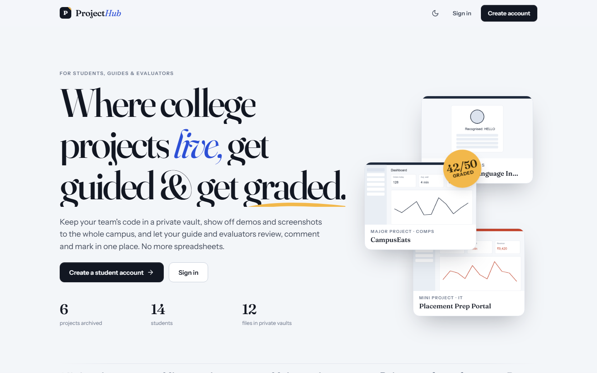

</div>

---

## Contents

- [Why ProjectHub?](#why-projecthub)
- [Features](#features)
- [Screenshots](#screenshots)
- [Quick start](#quick-start)
- [Demo accounts](#demo-accounts)
- [How it works](#how-it-works)
- [Who can see what](#who-can-see-what)
- [Data model](#data-model)
- [Configuration](#configuration)
- [Project structure](#project-structure)
- [Tech stack](#tech-stack)
- [Running tests](#running-tests)
- [Roadmap](#roadmap)

---

## Why ProjectHub?

Every semester, college project work ends up scattered:

- code sits on pen drives, in WhatsApp groups or in public GitHub repos anyone can copy;
- nobody outside the team ever sees what was built;
- guides track progress in their heads, and marks live in Excel sheets that get emailed around.

ProjectHub puts the whole life of a **mini, minor or major project** in one place, from the first synopsis to the final viva marks.

| | |
|---|---|
| 🔒 **Code stays private** | Only the team, their guide and the evaluators can open the code vault. |
| 🖼️ **Work gets seen** | Every project gets a public showcase page with photos, demo videos and a write-up. |
| 🧭 **Guides stay in the loop** | Milestones, line-by-line code comments and meeting notes. |
| 📝 **Marks without spreadsheets** | Rubric-based marking, lock and publish results, and one-click Excel export. |

---

## Features

### 👩‍🎓 For students
- **Create a project** in seconds. A group code like `MA1-26-COMPS-01` is generated for you.
- **Invite teammates** with a six-character invite code.
- **Private code vault**
  - Upload single files, a whole **folder** (drag & drop) or a **`.zip`**. Folder structure is kept, and `node_modules`, `.git` and `__pycache__` are skipped.
  - Every re-upload creates a **new version**, unchanged files are skipped, and any old version can be **restored**.
  - **Syntax-highlighted viewer** with line numbers, an in-browser **editor** and a **"changes vs previous version"** diff.
  - `README.md` files render nicely on the folder page.
- **Showcase page**: cover, gallery with lightbox, demo videos, tech-stack tags, links and references.
- **Milestones**: submit work for your guide's review and see their feedback.
- **My marks**: per-criterion marks and evaluator remarks once results are published.
- **Completion certificate (PDF)** once the project is marked completed.
- **Explore** every project in college: search, filter by type, branch, year or tech, like, and save for later.

### 🧑‍🏫 For guides
- **Find groups** without a guide and adopt them. Four default milestones are created automatically (Synopsis → Design review → Mid-term demo → Final submission).
- **Review submissions**: approve or request changes, with feedback. Set and edit due dates.
- **Comment on specific lines of code**. The whole team is notified.
- **Progress log** of meeting notes and weekly updates with next steps.
- **Similarity hint**: flags files that are byte-for-byte identical to another group's file.
- Dashboard of pending reviews and upcoming deadlines.

### 🧾 For evaluators & admins
- **Rubric builder** with any criteria and maximum marks (e.g. Implementation /20, Presentation /10).
- **Review rounds** for a batch of projects (type + semester + year, optionally one branch).
- **Marking sheet**: one row per student, live totals, validation against the maximum marks, and group remarks. Press <kbd>Enter</kbd> to jump to the next cell.
- **Lock** a round when marking is done, then **publish** results to students.
- **Export to Excel** (`.xlsx`) in one click.
- **Insights dashboard**: projects by branch, type and status, evaluation progress, and guide load.
- **People**: create guide, evaluator and admin accounts. **Feature** standout projects on Explore.
- **Project report (PDF)**: one page covering the abstract, team, milestones and marks.

### ✨ Everywhere
- In-app **notifications** (optional email) for comments, reviews, new teammates and results
- **Dark mode**, following your system setting with a manual toggle
- **Responsive**: works on phones
- Subtle **animations**: page transitions, scroll reveals, count-up stats and hover effects. All of them respect *reduced motion*.

---

## Screenshots

<table>
  <tr>
    <td width="50%">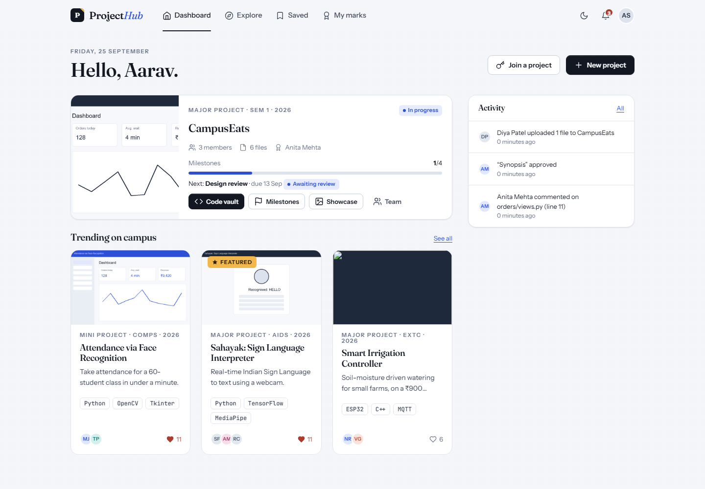<br><sub><b>Student dashboard</b>: your projects, milestone progress, what's trending</sub></td>
    <td width="50%">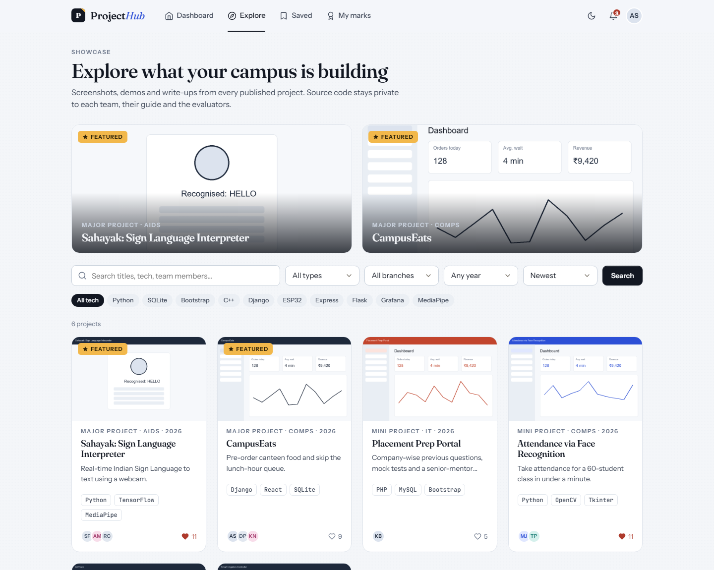<br><sub><b>Explore</b>: search and filter every published project</sub></td>
  </tr>
  <tr>
    <td>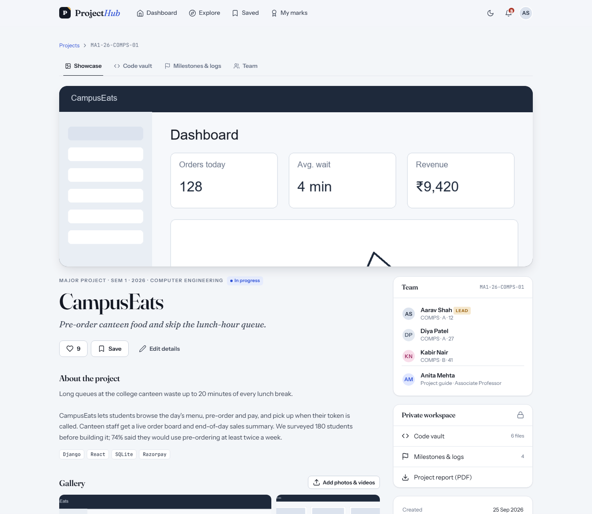<br><sub><b>Showcase page</b>: public write-up, gallery, team and guide</sub></td>
    <td>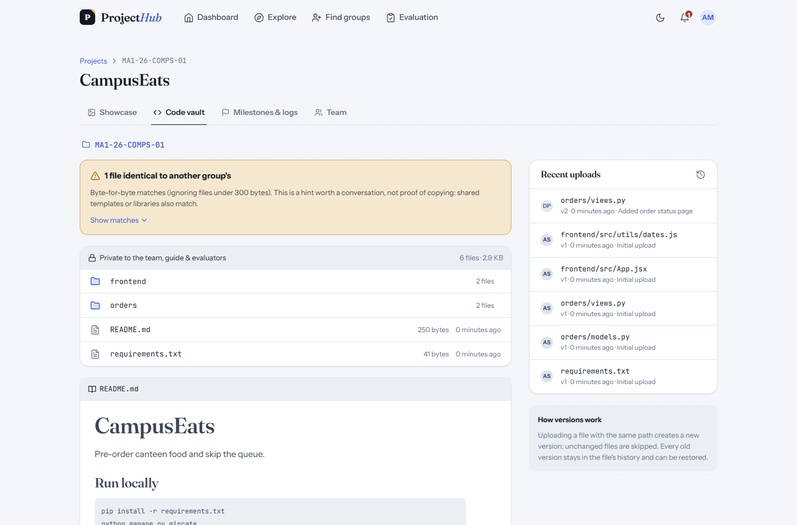<br><sub><b>Private code vault</b>: folders, versions, README preview, similarity hint</sub></td>
  </tr>
  <tr>
    <td>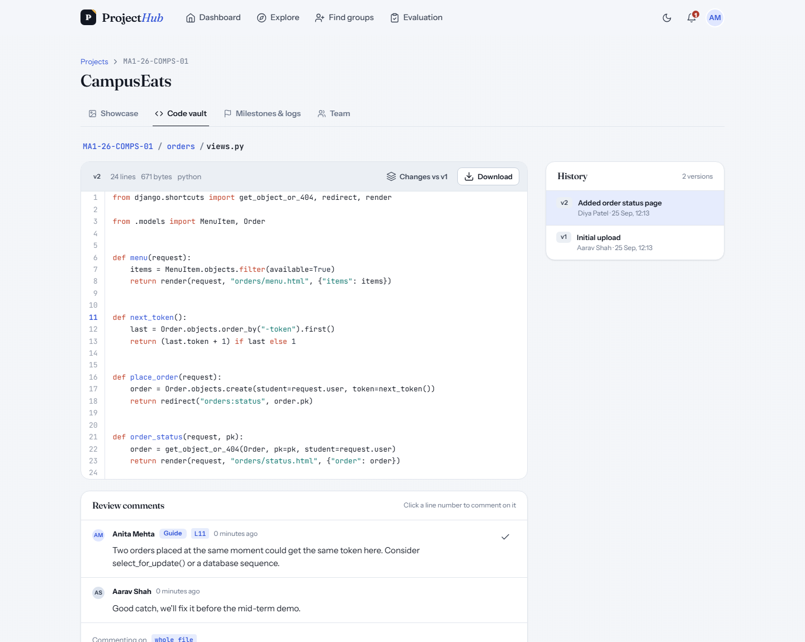<br><sub><b>Code viewer</b>: syntax highlighting, version history, line comments</sub></td>
    <td>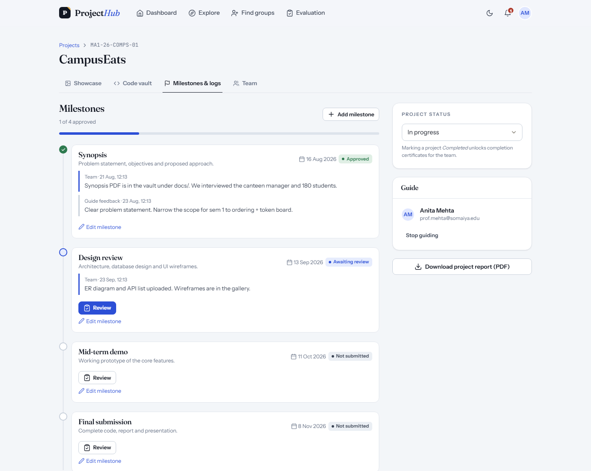<br><sub><b>Milestones & logs</b>: submit, review, approve</sub></td>
  </tr>
  <tr>
    <td>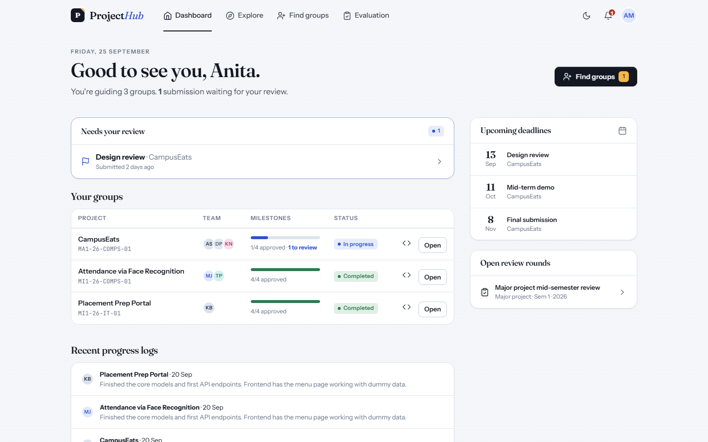<br><sub><b>Guide dashboard</b>: pending reviews and deadlines</sub></td>
    <td>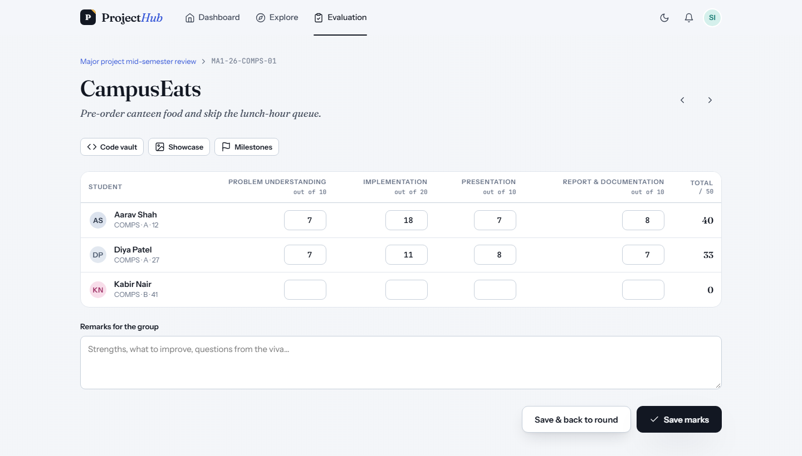<br><sub><b>Marking sheet</b>: rubric-based, per student</sub></td>
  </tr>
  <tr>
    <td>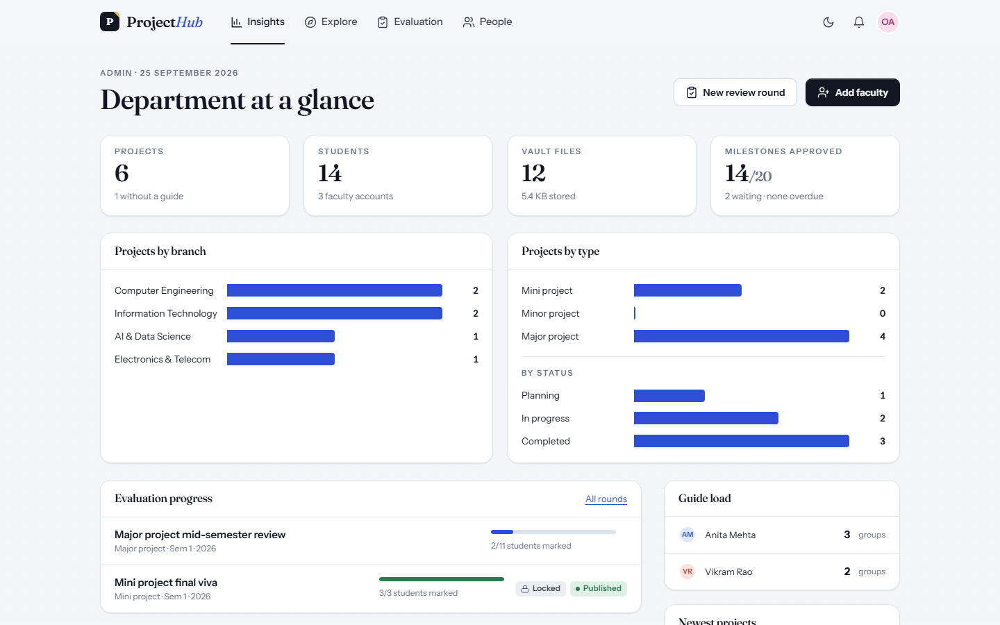<br><sub><b>Admin insights</b>: the department at a glance</sub></td>
    <td>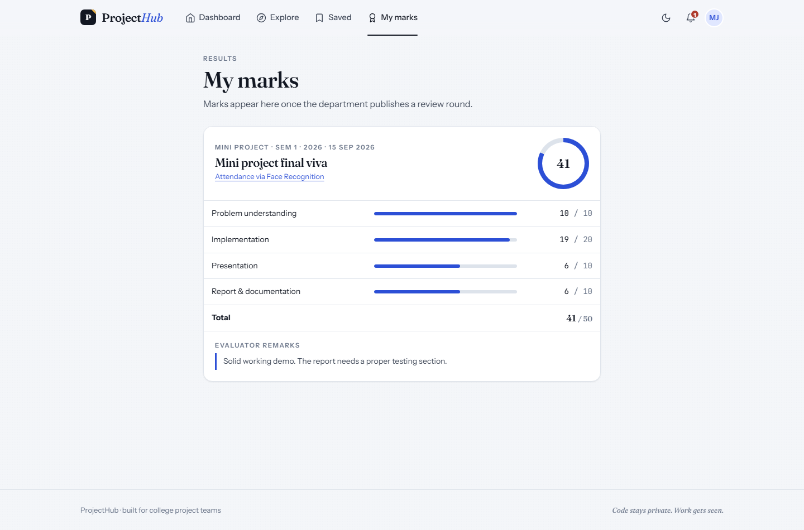<br><sub><b>My marks</b>: published results with remarks</sub></td>
  </tr>
  <tr>
    <td>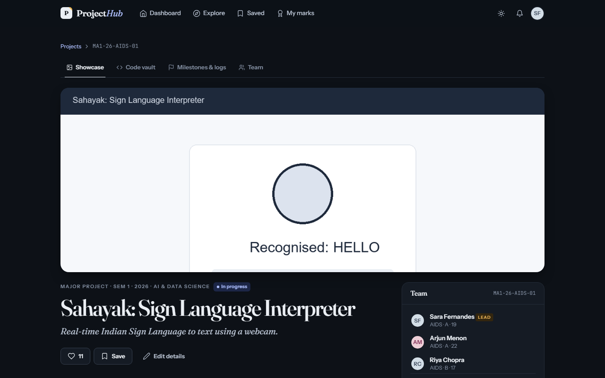<br><sub><b>Dark mode</b></sub></td>
    <td>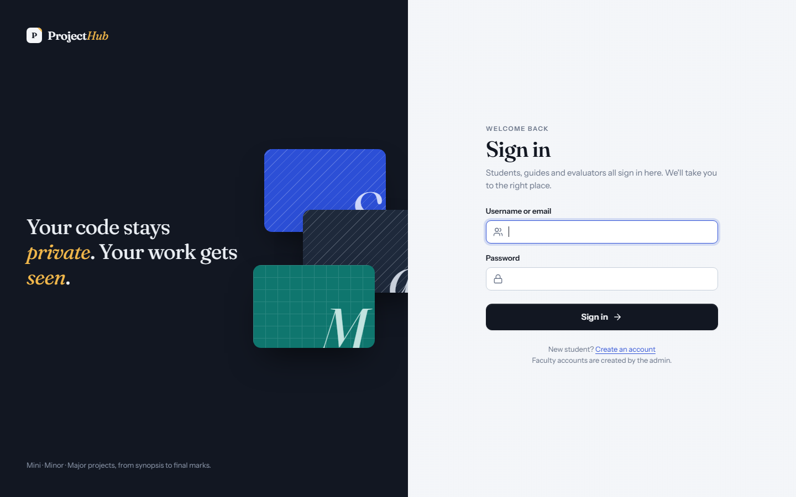<br><sub><b>Sign in</b>: one login for every role</sub></td>
  </tr>
</table>

<p align="center">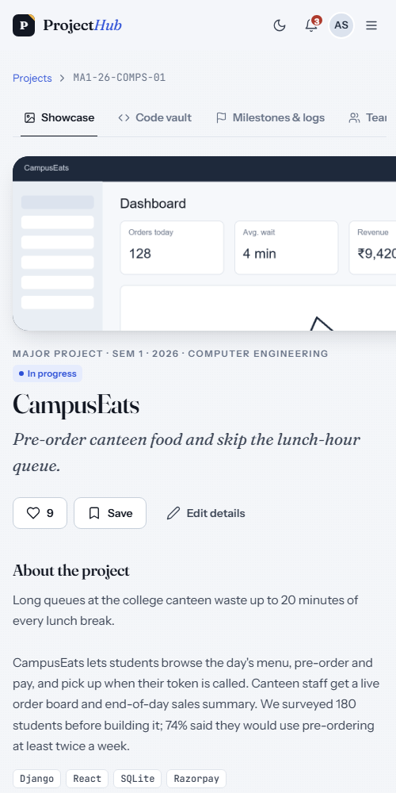<br><sub><b>Mobile view</b></sub></p>

---

## Quick start

> Requires **Python 3.10+**. No database server needed; everything is stored in SQLite.

```bash
# 1. Get the code
git clone https://github.com/Sagar-Shetty0804/Project_Hub.git
cd Project_Hub/Project_hub

# 2. (Optional) create a virtual environment
python -m venv .venv
.venv\Scripts\activate          # Windows
# source .venv/bin/activate     # macOS / Linux

# 3. Install dependencies
pip install -r requirements.txt

# 4. Create the database
python manage.py migrate

# 5. (Optional) load demo data: users, projects, code, screenshots, marks
python manage.py seed_demo

# 6. Run
python manage.py runserver
```

Open **http://127.0.0.1:8000** and sign in with one of the demo accounts below.

To start over with fresh demo data, run `python manage.py seed_demo --reset`.
To use the app without demo data, create your own admin with `python manage.py createsuperuser`.

---

## Demo accounts

All demo accounts use the password **`demo12345`**.

| Role | Username | Good for trying… |
|---|---|---|
| 🛠️ Admin | `admin` | Insights, People, creating rubrics and review rounds, publishing results |
| 🧑‍🏫 Guide | `prof.mehta` | Reviewing the pending "Design review", code comments, similarity hint |
| 🧑‍🏫 Guide | `prof.rao` | A second guide with different groups |
| 🧾 Evaluator | `dr.iyer` | Marking the open "Major project mid-semester review", Excel export |
| 👩‍🎓 Student | `aarav.shah` | Team lead of *CampusEats*: vault, uploads, milestones |
| 👩‍🎓 Student | `meera.joshi` | Published marks and a downloadable certificate |
| 👩‍🎓 Student | `sara.fernandes` | Team lead of *Sahayak* (sign-language interpreter) |

---

## How it works

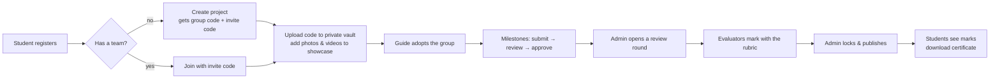

**Group codes** follow the college's old convention: `<type><semester>-<year>-<branch>-<group no>`.
For example, `MA1-26-COMPS-01` is the first *Major project*, semester 1, 2026, Computer Engineering.

| Code | Project type | Year of study |
|---|---|---|
| `MI` | Mini project | Second year |
| `MN` | Minor project | Third year |
| `MA` | Major project | Final year |

---

## Who can see what

| | Student (team member) | Other students | Project guide | Evaluator | Admin |
|---|:---:|:---:|:---:|:---:|:---:|
| Showcase page (photos, videos, abstract) | ✅ | ✅ | ✅ | ✅ | ✅ |
| Code vault | ✅ edit | ❌ | ✅ view + comment | ✅ view + comment | ✅ |
| Milestones & progress logs | ✅ submit | ❌ | ✅ review | ✅ view | ✅ |
| Marking sheet | ❌ | ❌ | ✅ own groups | ✅ | ✅ |
| Own published marks | ✅ | ❌ | – | – | – |
| Lock / publish rounds, rubrics, people | ❌ | ❌ | ❌ | ❌ | ✅ |

Vault files are stored in `Project_hub/private_media/`, **outside** the public media folder. They can only be downloaded through a view that checks these permissions, so guessing a URL doesn't work.

---

## Data model

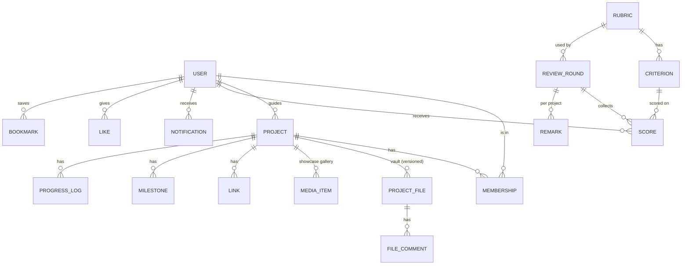

- **User** has a `role`: student, guide, evaluator or admin.
- **ProjectFile** keeps every version: `(project, path, version, is_latest, sha256)`. The SHA-256 hash powers both "unchanged file" skipping and the similarity hint.
- **Score** is one mark for one student on one criterion in one round.

---

## Configuration

Copy `Project_hub/.env.example` to `Project_hub/.env` and edit it:

| Variable | Default | What it does |
|---|---|---|
| `SECRET_KEY` | dev key | Django secret key. **Change it** for any real deployment. |
| `DEBUG` | `true` | Django debug mode |
| `ALLOWED_EMAIL_DOMAIN` | `somaiya.edu` | Only emails ending in this domain can register. Leave blank to allow any email. |
| `MAX_TEAM_SIZE` | `4` | Maximum students per project |
| `EMAIL_NOTIFICATIONS` | `false` | Also email important notifications |
| `EMAIL_HOST_USER` / `EMAIL_HOST_PASSWORD` | – | SMTP login (Gmail needs an *App Password*). Without it, emails are printed to the console. |

Students register themselves. **Guide, evaluator and admin accounts are created by an admin** on the *People* page, or in Django admin at `/admin/`.

---

## Project structure

```
projecthub/
├── README.md
├── docs/screenshots/          # images used in this README
└── Project_hub/               # the Django project (run commands from here)
    ├── manage.py
    ├── requirements.txt
    ├── .env.example
    ├── Project_hub/           # settings & root URLs
    ├── accounts/              # custom User with roles, login/register, settings, people
    ├── projects/              # projects, team, showcase media, likes, the code vault
    │   └── vault.py           # upload/zip handling, versioning, folder browsing, similarity check
    ├── mentoring/             # milestones and progress logs (guide workspace)
    ├── evaluation/            # rubrics, review rounds, scores, remarks, Excel export
    ├── notifications/         # in-app notifications (+ optional email)
    ├── core/                  # landing, dashboards, insights, PDFs, seed_demo, tests
    ├── templates/             # every page, sharing one base layout
    └── static/
        ├── css/app.css        # the whole design system (tokens, components, dark mode)
        └── js/app.js          # dropdowns, uploads with progress, lightbox, animations
```

---

## Tech stack

| Layer | Choice | Why |
|---|---|---|
| Backend | **Django 4.2+** | Batteries included: auth, ORM, admin, forms |
| Database | **SQLite** | Zero setup; this is a prototype with a small amount of data |
| Frontend | Django templates + **hand-written CSS** + **vanilla JS** | No build step and no framework to learn |
| Fonts | Fraunces (headings), Instrument Sans (UI), JetBrains Mono (code) | |
| Code highlighting | highlight.js | |
| Markdown (READMEs) | marked + DOMPurify | Sanitised before display |
| Excel export | openpyxl | |
| PDFs | ReportLab | Certificates and project reports |
| Images | Pillow | |

---

## Running tests

```bash
cd Project_hub
python manage.py test core
```

The tests cover group-code generation, vault privacy for each role, versioning, zip handling, path-traversal protection, invite codes, the college-email rule, marks validation and round locking, and the Excel export.

---

## Roadmap

Ideas for the next version:

- [ ] Side-by-side diff between any two versions
- [ ] Plagiarism check that goes beyond identical files (similar code)
- [ ] Multiple evaluators per round, with averaged marks
- [ ] Attendance for guide meetings
- [ ] Calendar export (.ics) for milestone deadlines
- [ ] Move to PostgreSQL + object storage if it ever needs to scale

---

<div align="center">
<sub>Built as a college project · Code stays private. Work gets seen.</sub>
</div>
